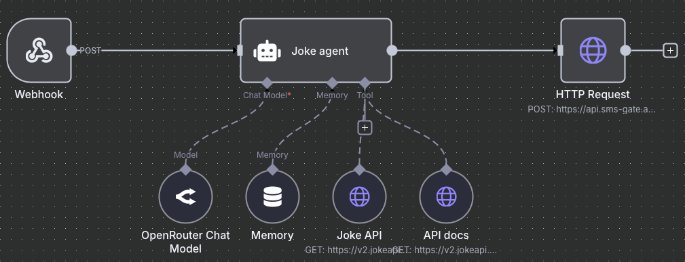

# 📱 Example n8n Integration

[](https://github.com/android-sms-gateway/example-webhooks-n8n)
[](https://opensource.org/licenses/Apache-2.0)

> **⚠️ Example Project Notice**  
> Not intended for production use without proper security review and modifications.

## 📋 Table of Contents
- [📱 Example n8n Integration](#-example-n8n-integration)
  - [📋 Table of Contents](#-table-of-contents)
  - [✨ About The Project](#-about-the-project)
    - [⚠️ Important Notes](#️-important-notes)
  - [🚀 Getting Started](#-getting-started)
    - [📦 Prerequisites](#-prerequisites)
    - [⚡ Installation](#-installation)
  - [⚙️ Configuration](#️-configuration)
    - [SMSGate API Credentials](#smsgate-api-credentials)
    - [OpenRouter API Credentials](#openrouter-api-credentials)
    - [Set Webhook URL](#set-webhook-url)
  - [🖥️ Usage](#️-usage)
  - [🏗️ Workflow Architecture](#️-workflow-architecture)
    - [1. Webhook Node](#1-webhook-node)
    - [2. Memory Node](#2-memory-node)
    - [3. AI Agent Node](#3-ai-agent-node)
    - [4. OpenRouter Chat Model](#4-openrouter-chat-model)
    - [5. Joke API \& API Docs Nodes](#5-joke-api--api-docs-nodes)
    - [6. HTTP Request Node](#6-http-request-node)
  - [📜 License](#-license)

## ✨ About The Project

n8n is a powerful workflow automation tool that allows you to integrate the SMSGate with AI services to create intelligent SMS-based applications. This example demonstrates how to build an AI-powered joke agent that responds to SMS messages with automated jokes.

**Example Project Features**:
- Receives SMS messages via webhook
- Uses AI (OpenRouter/Grok-4) to understand user requests
- Fetches jokes from the Joke API
- Sends joke responses back to the user via SMSGate API

### ⚠️ Important Notes

**This example intentionally omits**:

- Production-grade error handling
- Rate limiting
- Advanced security features
- Webhook authentication/verification

**Recommended for**:

- 🧪 Testing SMSGate integration
- 📚 Learning n8n and AI integration

## 🚀 Getting Started

### 📦 Prerequisites

- n8n account or self-hosted instance
- SMSGate API credentials
- OpenRouter API credentials

### ⚡ Installation

1. Open your n8n instance
2. Create a new workflow
3. Select "Import from URL" option in the workflow editor
4. Enter the following URL: https://raw.githubusercontent.com/android-sms-gateway/example-webhooks-n8n/master/workflow.json
5. Click "Import"

<p align="center"></p>

## ⚙️ Configuration

### SMSGate API Credentials

1. In n8n, go to **Credentials** → **Add credential**
2. Select **HTTP Basic Auth** type
3. Name it "SMSGate Dev"
4. Enter your SMSGate API credentials:
   - **Username**: Your API username
   - **Password**: Your API password

### OpenRouter API Credentials

1. In n8n, go to **Credentials** → **Add credential**
2. Select **OpenRouter API** type
3. Name it "OpenRouter account"
4. Enter your OpenRouter API key

### Set Webhook URL

1. Note the webhook URL from the Webhook node
2. Configure your SMSGate to send messages to this webhook URL
    ```bash
    curl -X POST -u <username>:<password> \
        -H "Content-Type: application/json" \
        -d '{ "url": "<your-n8n-webhook-url>", "event": "sms:received" }' \
        https://api.sms-gate.app/3rdparty/v1/webhooks
    ```
    Replace `<your-n8n-webhook-url>` with the actual URL of your n8n webhook node.

## 🖥️ Usage

1. Send an SMS message to the device with SMSGate app
2. The webhook node will receive the message and pass it to the AI agent
3. The AI agent will process the message and generate a response
4. The response will be sent back to the user

## 🏗️ Workflow Architecture

The workflow consists of the following key nodes:

### 1. Webhook Node
- **Purpose**: Receives SMS messages from the SMS Gateway
- **Input**: SMS payload with `phoneNumber` and `message`
- **Output**: Passes message content to the AI agent

### 2. Memory Node
- **Purpose**: Maintains conversation context per phone number
- **Session Key**: Uses phone number for unique sessions
- **Benefit**: Remembers previous interactions with the same user

### 3. AI Agent Node
- **Purpose**: Processes user requests and generates responses
- **System Prompt**: Optimized for SMS communication
- **Capabilities**: Understands natural language and uses available tools

### 4. OpenRouter Chat Model
- **Purpose**: Provides AI language processing
- **Model**: Grok 4 Fast
- **Integration**: Connected to the AI agent for intelligent responses

### 5. Joke API & API Docs Nodes
- **Purpose**: Fetch jokes and API documentation
- **Integration**: Available as tools for the AI agent
- **Flexibility**: AI can query specific joke types based on user preferences

### 6. HTTP Request Node
- **Purpose**: Sends responses back via SMSGate API
- **Endpoint**: `https://api.sms-gate.app/3rdparty/v1/messages`
- **Authentication**: Uses configured credentials
- **Payload**: Includes response text and recipient phone number

## 📜 License

This example code is released under [Apache License 2.0](LICENSE).
